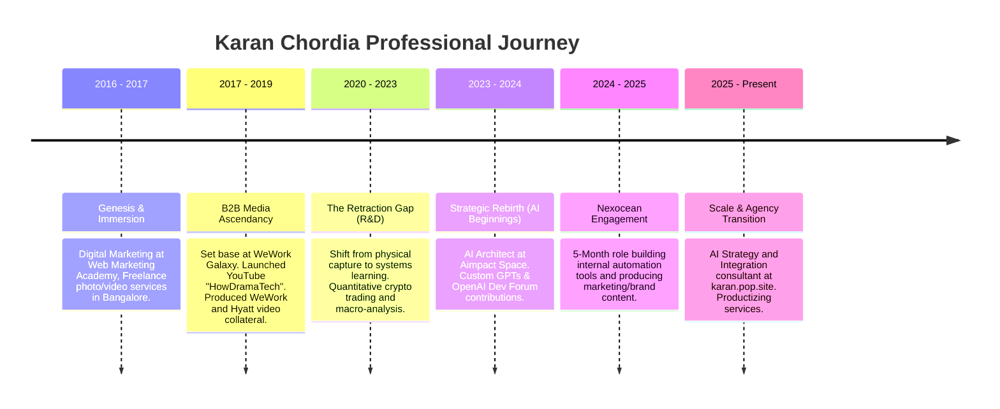

# Career Timeline

This document maps the chronological progression of Karan Chordia’s professional path, detailing milestones, transitions, and the physical/digital evidence associated with each era.

---

## 1. Timeline Overview

---

## 2. Chronological Epochs Detail

### Epoch 1: Genesis & Immersion (2016 – Early 2018)
*   **Dates:** January 2016 – July 2017
*   **Role:** Freelance Photographer/Videographer & Digital Marketing Apprentice
*   **Milestones:**
    *   Completed digital marketing training at Web Marketing Academy (`[Fact]`).
    *   Began shooting local freelance videography projects in central Bangalore (`[Fact]`).
    *   Listed photography business on Justdial directory under Residency Road (`[Fact]`).
*   **Evidence:** Justdial listing copy, personal site timeline entries (`[Fact]`).

### Epoch 2: B2B Media Ascendancy (Mid 2018 – Late 2019)
*   **Dates:** August 2017 – December 2019
*   **Role:** Content Director (Freelance) & Creator (HowDramaTech)
*   **Milestones:**
    *   Established commercial desk at WeWork Galaxy co-working space, Residency Road (`[Fact]`).
    *   Launched YouTube channel `HowDramaTech` on August 20, 2017 (`[Fact]`).
    *   Secured official vendor credits for WeWork India’s major Bangalore inaugurations (Vaishnavi Signature, ITI Limited, RMZ Latitude) (`[Fact]`).
    *   Shot cinematic drone compilations for local and international brands, published on AirVuz (`[Fact]`).
    *   Published professional and operational philosophies on Medium (`[Fact]`).
*   **Evidence:** YouTube video description credits ("Created by Karan Chordia"), AirVuz drone footage, Medium articles (`[Fact]`).

### Epoch 3: The Retraction Gap / Systems R&D (2020 – 2023)
*   **Dates:** January 2020 – February 2023
*   **Role:** Quantitative Crypto Trader & System Inquirer (Independent)
*   **Milestones:**
    *   Cessation of public vlogs/tech explainers on YouTube and Medium, shifting to private client video operations (`[Inference]`).
    *   Immersive study of decentralized market mechanics, macroeconomic forecasting, and technical charting on Binance Square (`[Fact]`).
    *   Mastery of technical analysis indicators (Fibonacci retracements, leverage futures) (`[Fact]`).
*   **Evidence:** Cessation of YouTube uploads after 2019, Binance Square social handles `KaranCho` / `HowDramaTech` (`[Fact]`).

### Epoch 4: Strategic Rebirth & AI Tooling (2023 – Present)
*   **Dates:** March 2023 – Present
*   **Role:** AI Architect (Aimpact Space) & AI Content Creator
*   **Milestones:**
    *   Joined Aimpact Space as AI Architect (March 2023) (`[Fact]`).
    *   Built and launched custom GPTs (e.g. Coursefy) on the OpenAI GPT store (`[Fact]`).
    *   Participated in technical developer community discussions on the OpenAI developer forums (`[Fact]`).
    *   Launched the productized solo consulting portal `karan.pop.site` (`[Fact]`).
*   **Evidence:** OpenAI Dev Forum records, GPTStore entries, `karan.pop.site` services registry (`[Fact]`).

### Epoch 5: Nexocean Engagement (2024 - 2025 window)
*   **Dates:** 5-Month Period (within 2024-2025)
*   **Role:** Internal Tools Developer & Content Producer
*   **Milestones:**
    *   Built internal automation tools for Nexocean's workforce consulting teams (`[Fact]`).
    *   Produced digital content and marketing assets for the company (`[Fact]`).
*   **Evidence:** LinkedIn corporate directory listing, founder confirmation (`[Fact]`).

---

## 3. Key Transition Analysis

| Transition Point | Trigger | Resulting Competency | Verification Status |
| :--- | :--- | :--- | :--- |
| **B2B Media to Crypto** | Macro economic shift (2020 pandemic) | Transitioned from visual shooting to quantitative systems logic & high-stress decision making. | Verified by channel inactivity + Binance logs. |
| **Crypto to AI Architect** | Acceleration of LLMs (early 2023) | Translated logical data analysis and systems thinking into prompt design, agents, and JSON pipelines. | Verified by OpenAI Forum activity & GPT releases. |
| **AI Consultant to Nexocean** | Need for commercial proof of work (2024/2025) | Applied custom tool building and content creation to a corporate recruiting/consulting environment. | Verified by founder validation. |
