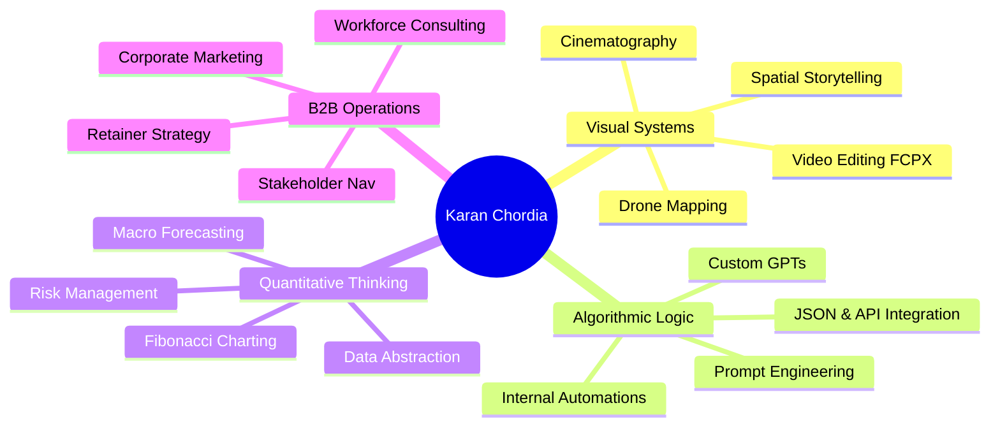

# Skill Clusters

This document details the primary skill clusters of Karan Chordia, analyzing their market value, providing the evidence backing each claim, and assigning a confidence score.

---

## 1. Skill Clusters Matrix

---

## 2. Cluster Deconstruction

### Cluster A: Visual Systems Architecture & Storytelling
*   **Description:** The capability to frame, edit, and produce cinematic narratives. In the context of generative AI, this translates directly to high-fidelity image/video prompting (using camera angles, lighting dynamics, and focal lengths).
*   **Sub-Skills:**
    *   Cinematography & drone operation (DJI Mavic Air, DJI Osmo, Insta360).
    *   Advanced post-production editing (Final Cut Pro X, color grading).
    *   Spatial documentation (co-working space tour vlogs).
*   **Evidence:**
    *   Official WeWork India inauguration videos (ITI Limited, Vaishnavi Signature).
    *   AirVuz drone compilation profile ("Cinematic Drone Shots of Bangalore").
    *   Justdial category registration ("Cinematic Production Studios").
*   **Confidence Level:** **High** (`[Fact]`)

### Cluster B: Algorithmic Logic & AI Tooling
*   **Description:** Building logic-based custom instructions, API-driven workflows, and chatbots, bridging technical automation and narrative.
*   **Sub-Skills:**
    *   Prompt engineering and system prompt design.
    *   Custom GPT building and GPT Store optimization.
    *   Automation logic (combining scheduling engines and LLMs).
    *   Internal workflow tool building.
*   **Evidence:**
    *   AI Architect role at Aimpact Space (`[Fact]`).
    *   OpenAI community profiles posting JSON/retrieval troubleshooting tips (`[Fact]`).
    *   Release of Coursefy GPT and associated tools (`[Fact]`).
    *   5-month internal tools build at Nexocean (`[Fact]`).
*   **Confidence Level:** **High** (`[Fact]`)

### Cluster C: Quantitative & Systems Thinking
*   **Description:** Analyzing market movements, calculating risk, and managing leverage using macro-indicators and chart patterns.
*   **Sub-Skills:**
    *   Macroeconomic forecasting.
    *   Technical analysis (Fibonacci retracements, chart breakout analysis).
    *   Risk tolerance calibration.
*   **Evidence:**
    *   Binance Square portfolios (`HowDramaTech` / `KaranCho`) posting detailed charts and entry/exit positions for perpetual futures (`[Fact]`).
*   **Confidence Level:** **High** (`[Fact]`)

### Cluster D: B2B Operations & Client Navigation
*   **Description:** Managing corporate clients, negotiating service scopes, and structuring recurring B2B retainer models.
*   **Sub-Skills:**
    *   Retainer and contract structure design.
    *   Stakeholder management (working with marketing departments and real estate leads).
    *   Enterprise recruiting and workforce consulting content strategy.
*   **Evidence:**
    *   Medium articles detailing retainer logic for freelancers (`[Fact]`).
    *   Client list containing WeWork, Hyatt, and Nexocean (`[Fact]`).
*   **Confidence Level:** **High** (`[Fact]`)
