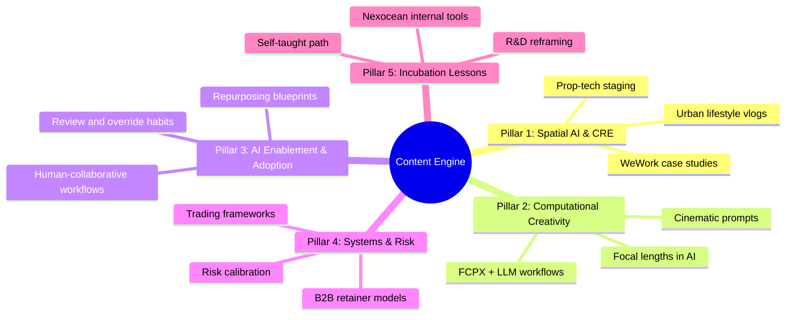

# Content Pillars & Distribution System

This document outlines the strategic content pillars designed to establish thought leadership, generate inbound leads, and position Karan Chordia as a premium B2B AI consultant.

Current editorial principle: Kramaniti content should not frame full automation as the default aspiration. The strongest point of view is human-collaborative system design: AI should assist, humans should lead, and workflows should define what is automated, assisted, reviewed, or kept human-led.

---

## 1. Content Pillars Overview

---

## 2. Pillar Deconstructions

### Pillar 1: Spatial AI & Co-Working Architecture
*   **Purpose:** Establishes domain authority in real estate, co-working, and prop-tech.
*   **Audience Value:** Teaches operators and developers how to cut visualization costs and automate member acquisition.
*   **Content Examples:**
    *   *LinkedIn Case Study:* "How we filmed WeWork Galaxy in 2018 vs. How I would digitally stage it with generative AI today for 1/10th the cost."
    *   *Newsletter:* "The Future of Co-working: Implementing automated AI agents to qualify and nurture workspace leads."

### Pillar 2: Computational Creativity (The Creative-Tech Duality)
*   **Purpose:** Showcases Karan's unique differentiator—merging filmmaking with code.
*   **Audience Value:** Teaches creators and marketers how to prompt image/video models using professional cinematographic parameters instead of generic text descriptions.
*   **Content Examples:**
    *   *Twitter/X Thread:* "I shot commercial films for Hyatt Centric. Here is how I translate camera angles, focal lengths (35mm vs 85mm), and lighting dynamics (Rembrandt, chiaroscuro) into Midjourney and Runway prompts for high-fidelity brand assets."
    *   *Video Reel:* "Setting up a local LLM to speed up my Final Cut Pro video logging by 400%."

### Pillar 3: AI Enablement & Adoption
*   **Purpose:** Creates demand for Kramaniti's systems work by explaining how intelligent workflows become useful inside a real team.
*   **Audience Value:** Teaches founders how to decide what should be automated, what should be AI-assisted, what requires review, and how to build adoption habits around new systems.
*   **Content Examples:**
    *   *LinkedIn Post:* "The human-collaborative workflow: how to decide what AI drafts, what the team reviews, and what the founder still owns."
    *   *Newsletter:* "Why adoption fails after the demo: usage rules, override points, and the team habits that make an AI-assisted system stick."

### Pillar 4: Systems, Risk, & Quantitative Logic
*   **Purpose:** Highlights analytical rigor, building confidence with enterprise buyers who want logical systems, not just creative fluff.
*   **Audience Value:** Shares frameworks for decision-making, pricing strategy, and risk management.
*   **Content Examples:**
    *   *LinkedIn Post:* "Why I retired my legacy creative agency brand and transitioned to values-based pricing: What high-frequency crypto trading taught me about managing business downside."
    *   *Newsletter:* "Managing token context limits is identical to managing risk in futures trading. Here's why."

### Pillar 5: Incubation Lessons (The Founder Journey)
*   **Purpose:** Build personal connection, trust, and alignment with other startup founders.
*   **Audience Value:** Provides inspiration and tactical upskilling advice for self-taught professionals.
*   **Content Examples:**
    *   *LinkedIn Post:* "In 2020, I stopped publishing on YouTube. I spent 3 years in the trenches studying market algorithms and LLM code. Here’s why stepping back from public building was the best decision for my consulting career."
    *   *Case Study:* "Building internal tools: 5 months of automations at Nexocean and the workflow lessons shipped."
