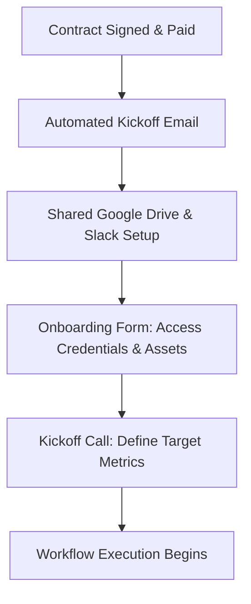
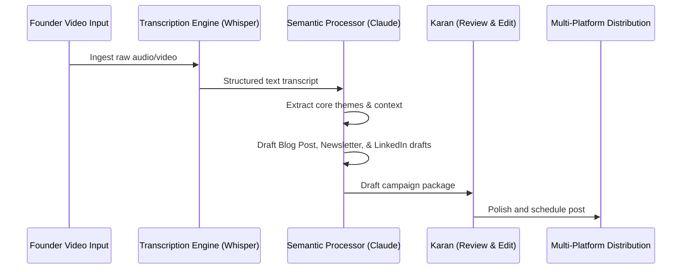

# AI Service Workflows

This document establishes the step-by-step operational workflows for executing the consultancy’s services, ensuring high quality, low friction, and structured delivery.

---

## 1. Client Onboarding Workflow

*   **Objective:** Seamlessly transition a new client into the ecosystem, gather technical credentials, and define target metrics within 48 hours of contract signing.

### Steps & Checklist
1.  **Slack & Drive Provisioning**: Create a dedicated client Slack channel (`#client-company-consulting`) and a secure Google Drive folder (`Client - Workspace`).
2.  **Asset Intake Form**: Send onboarding questionnaire to collect:
    *   API access keys (OpenAI, Make.com, HubSpot, etc.).
    *   Brand guidelines, style sheets, and sample videos.
3.  **Onboarding Kickoff Call (30 mins)**: Align on goals, set milestone dates, and assign action items.
4.  **Baseline Audit Prep**: Review provided credentials and schedule the audit sprint.

---

## 2. AI Audit & Strategy Workflow (Sprint Delivery)

*   **Objective:** Deliver a comprehensive AI integration blueprint and stack recommendation within 14 days of kickoff.

### Stage 1: Discovery & Mapping (Days 1 - 5)
*   **Step 1.1**: Audit client's existing workflows: Interview team members to identify manual tasks, content bottlenecks, and software dependencies.
*   **Step 1.2**: Record time spent on repetitive tasks (e.g., manual content editing, lead sorting).
*   **Step 1.3**: Document existing API access points and database formats.

### Stage 2: Stack Design & Prototyping (Days 6 - 10)
*   **Step 2.1**: Select appropriate AI models (e.g., GPT-4o for tasks requiring logical analysis, Claude for creative writing, local models for sensitive data).
*   **Step 2.2**: Structure integration blueprints (API routing, data flows, and Make.com/Zapier diagrams).
*   **Step 2.3**: Build a mock utility or custom GPT prototype as proof of concept.

### Stage 3: Delivery & Blueprint Handover (Days 11 - 14)
*   **Step 3.1**: Create the AI Integration Playbook (PDF document).
*   **Step 3.2**: Host the Blueprint Presentation Call: Walk the client through the recommendations and present the prototype.
*   **Step 3.3**: Pitch Tier 2 (Narrative Kit) or Tier 3 (Automation Build) for implementation.

---

## 3. AI-Powered Content Repurposing Workflow

*   **Objective:** Convert raw, unedited video assets (Loom, Zoom recordings) into structured, multi-platform written campaigns.

### Steps & Checklist
1.  **Ingestion & Transcription**: Ingest video files. Transcribe using OpenAI Whisper API (`[Fact]`).
2.  **Semantic Decomposition**: Process the transcript using a custom LLM prompt configured with the founder's brand tone (`[Recommendation]`).
    *   Extract key insights, frameworks, and stories.
    *   Separate technical code snippets from narrative.
3.  **Drafting Multi-Formats**:
    *   Draft 1 long-form article (Medium/Substack).
    *   Draft 1 weekly newsletter.
    *   Draft 3 LinkedIn posts (Hook, Body, CTA).
4.  **Quality Control Check**:
    *   Are the prompt outputs clean and free of "AI jargon" (e.g. *delve*, *testament*)?
    *   Are camera angles and visual styles preserved in image/video outputs?
5.  **Human-in-the-loop Editing**: Refine drafts to ensure voice authenticity. Schedule for distribution.

---

## 4. Bespoke Automation & Agent Workflow (Custom Builds)

*   **Objective:** Develop, test, and deploy custom-trained AI agents and automated API-driven workflows.

### Steps & Checklist
1.  **API Schema & Database Setup**: Map endpoints (e.g. Slack Webhook, HubSpot API). Structure vectors/knowledge databases for RAG.
2.  **System Instruction Construction**: Write the master system prompt defining agent role, context limits, tone parameters, and "Do Not Assume" constraints.
3.  **Logical Flow Implementation**: Build routing nodes in Make.com/Zapier (e.g. IF email is spam, ignore; IF it contains booking query, send Calendly).
4.  **Context & Token Optimization**: Test context window boundaries, system latency, and API rate limits.
5.  **Edge Case Testing**: Run adversarial tests (prompt injection, incorrect data formats) to ensure stability.
6.  **Handoff & Maintenance Setup**: Document setup requirements and deploy monitoring loops.
