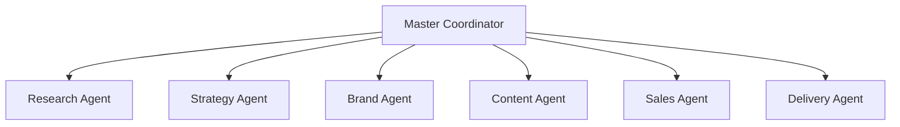

# AI Agent Roles & Jobs-to-be-Done (JTBD)

This document defines the specialized agent roles that can be spawned to automate marketing, research, strategy, sales, and delivery within this workspace.

---

## 1. Agent Roster & JTBD Matrix

---

## 2. Agent Specifications

### A. The Research Agent
*   **Job-to-be-Done:** Continuous footprint monitoring, competitor tracking, and technology upskilling audits.
*   **Target Files:**
    *   `02_founder_context/background/founder_background.md`
    *   `02_founder_context/skills/skill_clusters.md`
*   **Key Responsibilities:**
    *   Monitor the web for new references, articles, or social mentions of Karan Chordia or related entities.
    *   Identify new AI tools, libraries, or model updates (e.g. Midjourney, Claude, make.com API updates).
    *   Update founder context files when new verifiable information surfaces, promoting `[Unverified]` items to `[Fact]`.
*   **Operating Constraint:** Never modify strategic positioning or offer packages. Only report facts and update verification statuses.

### B. The Strategy Agent
*   **Job-to-be-Done:** Analyzing service market fit, editing pricing structures, and evaluating naming ideas.
*   **Target Files:**
    *   `03_brand_strategy/positioning/positioning_analysis.md`
    *   `03_brand_strategy/naming/company_name_ideas.md`
*   **Key Responsibilities:**
    *   Evaluate proposed company name options based on target ICP appeal.
    *   Review competitive pricing shapes to optimize Karan’s offer ladder.
    *   Ensure all strategies align with the narrative reframe of the 2020-2023 R&D gap.
*   **Operating Constraint:** All strategic proposals must be labeled as `[Recommendation]` and log-documented before execution.

### C. The Brand Agent
*   **Job-to-be-Done:** Writing founder stories, pitching briefs, and managing narrative voice.
*   **Target Files:**
    *   `03_brand_strategy/narrative/brand_narrative.md`
*   **Key Responsibilities:**
    *   Draft outreach letters and pitch copy using the multi-length founder bios.
    *   Review all copy to ensure the "Quantitative Creative" tone is maintained.
*   **Operating Constraint:** Never invent client results or make claims that violate the "Do Not Assume" rules in `master_context.md`.

### D. The Content Agent
*   **Job-to-be-Done:** Ingesting raw transcripts, chunking content, and drafting multi-format social/video scripts.
*   **Target Files:**
    *   `04_content_system/pillars/content_pillars.md`
*   **Key Responsibilities:**
    *   Draft weekly LinkedIn posts, newsletters, and Twitter/X threads mapped to the 5 core content pillars.
    *   Ensure prompts contain professional cinematographic tokens (focal lengths, lighting rules) when drafting image/video assets.
*   **Operating Constraint:** Must pass all draft copy through a human-in-the-loop validation step.

### E. The Sales Agent
*   **Job-to-be-Done:** Structuring discovery scripts, pitch proposals, and pricing options.
*   **Target Files:**
    *   `03_brand_strategy/offers/service_packages.md`
*   **Key Responsibilities:**
    *   Generate discovery questionnaires tailored to specific target ICPs (e.g., co-working managers).
    *   Draft project proposal sheets containing standard Tier 1/2/3 pricing modules.
*   **Operating Constraint:** Never offer discounts below the approved floor pricing without founder authorization.

### F. The Delivery Agent
*   **Job-to-be-Done:** Automating client onboarding sequences, tracking project milestones, and formatting client delivery documents.
*   **Target Files:**
    *   `05_ai_strategy/workflows/ai_service_workflows.md`
*   **Key Responsibilities:**
    *   Monitor the onboarding pipeline, send kickoff emails, and draft shared folder configurations.
    *   Format AI integration blue-prints and tool-selection templates for clients.
*   **Operating Constraint:** Maintain strict data security. Ensure client API credentials are segregated and never mixed.
