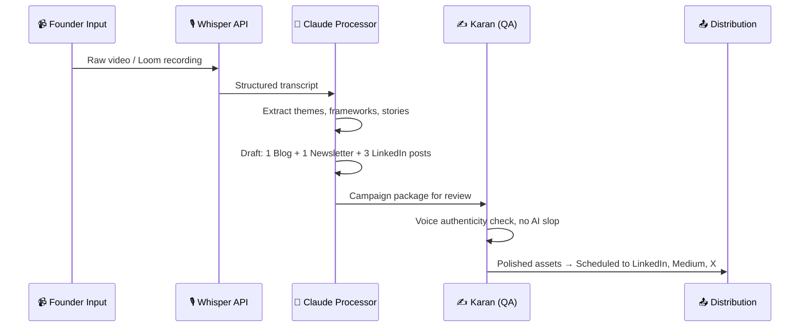
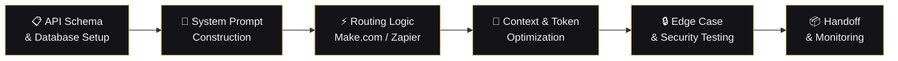

# Website Structure & Wireframe

**Purpose:** Define the complete frontend architecture for the Kramaniti one-page portfolio website. This document maps every section, its content hierarchy, interactive elements, and conversion objectives. It serves as the canonical brief for development — whether hand-coded, built in Framer/Webflow, or generated via code.

**Key Findings:** A single-page structure is optimal for the current launch phase: it concentrates SEO authority on one URL, reduces development scope, and funnels all visitor attention toward a single CTA. Multi-page expansion (dedicated case study pages, blog, /tools subdomain) should be planned for Phase 2.

**Related Files:**
*   [brand_identity_guidelines.md](file:///Users/k.c/kramaniti/03_brand_strategy/positioning/brand_identity_guidelines.md) — Visual system (colors, fonts, components)
*   [positioning_analysis.md](file:///Users/k.c/kramaniti/03_brand_strategy/positioning/positioning_analysis.md) — Competitive positioning and ICPs
*   [brand_narrative.md](file:///Users/k.c/kramaniti/03_brand_strategy/narrative/brand_narrative.md) — Copy sources (bios, elevator pitch)
*   [service_packages.md](file:///Users/k.c/kramaniti/03_brand_strategy/offers/service_packages.md) — Offer ladder and pricing
*   [ai_service_workflows.md](file:///Users/k.c/kramaniti/05_ai_strategy/workflows/ai_service_workflows.md) — Delivery workflow diagrams
*   [domain_and_handles_registry.md](file:///Users/k.c/kramaniti/03_brand_strategy/naming/domain_and_handles_registry.md) — Domain and hosting decisions

---

## 1. Site Architecture Map

```mermaid
graph TD
    subgraph "kramaniti.com — One-Page Portfolio"
        NAV["🔝 Fixed Navbar<br/>Logo | Story | Services | Work | Workflows | Contact"]

        S1["Section 1: HERO<br/>━━━━━━━━━━━━━━━━━━<br/>Core positioning headline<br/>Subheading with value prop<br/>Email capture form<br/>Ambient gradient background"]

        S2["Section 2: THE STORY<br/>━━━━━━━━━━━━━━━━━━<br/>3-epoch career narrative<br/>Visual timeline progression<br/>Videography → Trading → AI Architect"]

        S3["Section 3: SERVICES & OFFERS<br/>━━━━━━━━━━━━━━━━━━<br/>4-tier offer ladder cards<br/>Pricing ranges<br/>Scope summaries + CTA per tier"]

        S4["Section 4: CREDIBILITY<br/>━━━━━━━━━━━━━━━━━━<br/>WeWork · Hyatt · Nexocean case cards<br/>Client logos / brand marks<br/>Key metric callouts"]

        S5["Section 5: THE WORKFLOWS<br/>━━━━━━━━━━━━━━━━━━<br/>Interactive pipeline diagrams<br/>Make.com + Claude flow visualization<br/>Content repurposing engine demo"]

        S6["Section 6: CALL TO ACTION<br/>━━━━━━━━━━━━━━━━━━<br/>Lead capture form (Name, Email, Company, Budget)<br/>Calendly embed / booking link<br/>Social proof strip"]

        FT["📄 Footer<br/>━━━━━━━━━━━━━━━━━━<br/>Copyright · Social links · Kramaniti wordmark"]
    end

    NAV --> S1
    S1 --> S2
    S2 --> S3
    S3 --> S4
    S4 --> S5
    S5 --> S6
    S6 --> FT

    style S1 fill:#0A0A0F,stroke:#C9A84C,color:#F0F0F5
    style S2 fill:#141418,stroke:#2A2A32,color:#F0F0F5
    style S3 fill:#0A0A0F,stroke:#2A2A32,color:#F0F0F5
    style S4 fill:#141418,stroke:#2A2A32,color:#F0F0F5
    style S5 fill:#0A0A0F,stroke:#2A2A32,color:#F0F0F5
    style S6 fill:#141418,stroke:#C9A84C,color:#F0F0F5
```

---

## 2. Section-by-Section Wireframe Specification

### Section 1: Hero

**Objective:** Capture attention in under 3 seconds. Communicate who Kramaniti is, what it does, and provide an immediate conversion path.

| Element | Specification |
| :--- | :--- |
| **Background** | `Dark Depth` gradient (`#0A0A0F` → `#141418` → `#1E1E24`) with a subtle `Ambient Glow` radial gradient behind the headline text |
| **Headline (H1)** | `[Recommendation]`: *"We architect intelligent media systems."* — Pulled directly from the core positioning statement in [positioning_analysis.md](file:///Users/k.c/kramaniti/03_brand_strategy/positioning/positioning_analysis.md) |
| **Subheading** | *"Bridging cinematic storytelling and autonomous AI infrastructure for modern enterprises."* — Set in Inter 400, `Silver Mist (#9B9BA8)`, 18px |
| **Email Capture** | Single-field form: `[Your work email]` + Primary CTA button *"Get the AI Audit Blueprint"*. Form submits to a Make.com webhook → stores in Google Sheets → triggers a Brevo (Sendinblue) welcome email sequence |
| **Visual Element** | Subtle animated particle field or slow-panning abstract waveform (WebGL or CSS animation). Must NOT be a generic AI brain/neural network visual. Consider a topographic mesh or market chart abstraction referencing the trading systems background |
| **Scroll Indicator** | Animated downward chevron at bottom of viewport, fading on scroll |

**Conversion Goal:** Email capture for the lead nurture sequence.

---

### Section 2: The Story

**Objective:** Reframe Karan's non-linear career as a deliberate, strategic progression. Transform the perceived 2020-2023 gap into a credibility asset.

| Element | Specification |
| :--- | :--- |
| **Section Header (H2)** | *"The System Behind the Story"* |
| **Narrative Structure** | Three-column (desktop) / stacked (mobile) epoch cards with a connecting horizontal timeline bar |

**Epoch Cards:**

| Epoch | Time Period | Title | Description | Visual |
| :--- | :--- | :--- | :--- | :--- |
| **01** | 2017 – 2019 | *Spatial Capture* | *"Directing commercial cinematography and drone mapping for the rise of WeWork India and Hyatt Centric. Built distribution to 1,000+ YouTube subscribers and 15K Instagram followers documenting Bengaluru's co-working boom."* `[Fact]` | Muted still from a drone cityscape or co-working interior. Gold `01` numbering. |
| **02** | 2020 – 2023 | *Systems R&D* | *"A deliberate withdrawal from public content to study the logic underneath. Three years inside quantitative trading, macroeconomic forecasting, and algorithmic market systems — developing the systems-thinking that powers every workflow we build today."* `[Fact]` / `[Inference]` | Abstract market chart visualization or candlestick pattern rendered in brand palette. Gold `02` numbering. |
| **03** | 2023 – Present | *Autonomous Architecture* | *"Returned as an AI Architect — building custom GPTs, autonomous agent systems, and automated content engines for scaling startups and enterprise teams. From capturing reality with cameras to architecting it with code."* `[Fact]` | Clean screenshot of a Make.com workflow or code editor with an agent prompt visible. Gold `03` numbering. |

**Design Notes:**
*   `[Recommendation]`: Use `IntersectionObserver`-triggered scroll animations — each epoch card fades in and translates up as it enters viewport (600ms, ease-in-out).
*   The connecting timeline bar should use the `Gold Horizon` gradient to visually thread the three epochs together.
*   Reference the full career timeline at [career_timeline.md](file:///Users/k.c/kramaniti/02_founder_context/timeline/career_timeline.md) for verified dates and milestones.

---

### Section 3: Services & Offers

**Objective:** Present the offer ladder clearly. Each tier must communicate scope, ideal client, deliverables, and price range — with a distinct CTA that routes to the appropriate conversion path.

| Element | Specification |
| :--- | :--- |
| **Section Header (H2)** | *"What We Build"* |
| **Section Subheading** | *"Four tiers of engagement. From a focused audit to a full-service content engine."* |
| **Layout** | 4-column grid (desktop) / 2×2 grid (tablet) / vertical stack (mobile). Each tier is a card component. |

**Tier Cards:**

| Tier | Card Title | Label | Price Range | Key Deliverables | CTA Text |
| :--- | :--- | :--- | :--- | :--- | :--- |
| **1** | AI Workflow Audit | ENTRY POINT | ₹75K – ₹1.5L | AI Stack Map, 1 Prototype Spec, Strategy Blueprint PDF | *"Book a Discovery Call"* → Calendly |
| **2** | Founder Narrative Kit | CORE PROJECT | ₹1.5L – ₹3L | 1 Hero Video, 5 Social Shorts, Repurposing Kit (3 blogs, 1 newsletter, 5 threads) | *"Discuss Your Story"* → Calendly |
| **3** | Autonomous Agent Build | PREMIUM BUILD | ₹3L – ₹6L | 1 Custom AI Agent, 1 API Pipeline, Training & Handoff Playbook | *"Scope Your Build"* → Calendly |
| **4** | Content Engine Retainer | ONGOING | ₹1.2L – ₹2.5L/mo | Weekly content assets, monthly analytics dashboard, pipeline optimization | *"Explore the Retainer"* → Calendly |

**Design Notes:**
*   `[Recommendation]`: Tier 3 (Premium Build) should be visually highlighted with a `Burnished Gold` border and a subtle "MOST POPULAR" or "HIGH IMPACT" badge to guide prospects toward the highest-value engagement.
*   Price ranges should display in both ₹ (INR) and $ (USD) with a small toggle or dual display.
*   All pricing sourced from [service_packages.md](file:///Users/k.c/kramaniti/03_brand_strategy/offers/service_packages.md).

---

### Section 4: Credibility

**Objective:** Provide social proof through verified client engagements. No invented metrics or unverified claims.

| Element | Specification |
| :--- | :--- |
| **Section Header (H2)** | *"Trusted By"* |
| **Layout** | Horizontal scrolling card carousel (desktop + mobile). Each card is a mini case study. |

**Case Study Cards:**

| Client | Engagement Type | Summary | Evidence Status |
| :--- | :--- | :--- | :--- |
| **WeWork India** | Commercial Videography Vendor | Directed cinematic inaugural coverage for WeWork Galaxy, Vaishnavi Signature, ITI Limited, and RMZ Latitude locations across Bengaluru. Produced aerial drone mapping and brand content during the 2017-2019 Indian co-working expansion. | `[Fact]` — Verified via YouTube credits, AirVuz portfolio, and [career_timeline.md](file:///Users/k.c/kramaniti/02_founder_context/timeline/career_timeline.md) |
| **Hyatt Centric** | Commercial Content Production | Produced cinematic brand content and drone footage for the Hyatt Centric property, translating luxury hospitality aesthetics into digital distribution-ready video assets. | `[Fact]` — Verified via portfolio references |
| **Nexocean** | Internal Automation & Content | Built internal automation tools for the workforce consulting team and produced digital marketing assets over a 5-month contract engagement. | `[Fact]` — Verified via LinkedIn corporate listing and founder confirmation. `[Constraint]`: Do not describe as founder/ownership role. |

**Design Notes:**
*   `[Recommendation]`: Display client names as large typography (Outfit 600, `Ice White`) rather than logos. We do not have confirmed permission to use client logos, and text-based credibility markers are easier to verify and less legally risky (`[Constraint]`).
*   `[Recommendation]`: Below the case study carousel, add a "Numbers Strip" — a horizontal band displaying 3-4 verified metrics. Only use verifiable data:
    *   *"1,050+ YouTube subscribers"* `[Fact]`
    *   *"15K+ Instagram followers"* `[Fact]` (per [positioning_analysis.md](file:///Users/k.c/kramaniti/03_brand_strategy/positioning/positioning_analysis.md))
    *   *"4+ years in B2B commercial media"* `[Fact]`
    *   *"3+ years in algorithmic systems R&D"* `[Fact]`

---

### Section 5: The Workflows

**Objective:** Visually demonstrate the operational sophistication of the delivery system. Show — don't tell — how the Make.com + Claude pipeline works. This section converts skeptics who need to see the "how" before they buy the "what."

| Element | Specification |
| :--- | :--- |
| **Section Header (H2)** | *"How It Works"* |
| **Section Subheading** | *"Behind every deliverable is an engineered pipeline. Here is what ours looks like."* |
| **Layout** | Two interactive workflow diagrams, stacked vertically, with tabbed or accordion toggle |

**Workflow Diagram 1: Content Repurposing Engine**

*   `[Recommendation]`: Render this as an animated step-through on the website — each step highlights sequentially as the user scrolls (scroll-driven animation) or clicks through (step indicator).
*   Source: [ai_service_workflows.md](file:///Users/k.c/kramaniti/05_ai_strategy/workflows/ai_service_workflows.md), Section 3.

**Workflow Diagram 2: Custom Agent Build Pipeline**

*   Source: [ai_service_workflows.md](file:///Users/k.c/kramaniti/05_ai_strategy/workflows/ai_service_workflows.md), Section 4.

**Design Notes:**
*   `[Recommendation]`: Use an interactive (clickable or scroll-triggered) version of these diagrams rather than static images. Consider using a library like D3.js for custom rendering, or pre-rendering the Mermaid diagrams as SVGs and animating with CSS/JS.
*   The tool/brand names (Whisper, Claude, Make.com) should be displayed — they signal technical specificity and differentiate Kramaniti from vague "we use AI" competitors.

---

### Section 6: Call to Action

**Objective:** Convert interested visitors into booked discovery calls or captured leads. This is the terminal conversion point of the page.

| Element | Specification |
| :--- | :--- |
| **Section Header (H2)** | *"Let's Build Something"* |
| **Section Subheading** | *"Tell us about your project. We respond within 24 hours."* |
| **Layout** | Split layout — left column: lead capture form; right column: Calendly inline embed |

**Lead Capture Form Fields:**

| Field | Type | Required | Placeholder |
| :--- | :--- | :--- | :--- |
| Name | Text | Yes | *"Your full name"* |
| Work Email | Email | Yes | *"name@company.com"* |
| Company / Brand | Text | Yes | *"Company or brand name"* |
| Budget Range | Dropdown | No | *"Select budget range"* → Options: Under ₹75K / ₹75K – ₹1.5L / ₹1.5L – ₹3L / ₹3L – ₹6L / ₹6L+ / Not sure yet |
| Message | Textarea | No | *"Tell us briefly what you're looking for"* |
| Submit Button | Primary CTA | — | *"Send Project Brief"* |

**Form Backend:**
*   `[Recommendation]`: Form submits to a Make.com webhook → writes to a Google Sheet (lead tracker) → sends a Slack notification to `#new-leads` → triggers a Brevo autoresponder email with a PDF version of the AI Audit Blueprint as a lead magnet.

**Calendly Embed:**
*   `[Recommendation]`: Embed a Calendly inline widget (not just a link) for a 30-minute "Discovery Call" event type. Style the embed to match the dark palette using Calendly's CSS customization options (background: `#141418`, text: `#F0F0F5`, accent: `#C9A84C`).

---

### Navigation Bar

| Element | Specification |
| :--- | :--- |
| **Position** | Fixed top, `backdrop-filter: blur(12px)` with `rgba(10,10,15,0.85)` background |
| **Logo** | Kramaniti wordmark (Outfit 700, `Ice White`) — left-aligned. "K" in `Burnished Gold`. |
| **Nav Links** | Story · Services · Work · Workflows · Contact — smooth scroll to section anchors |
| **CTA Button** | *"Book a Call"* (Primary CTA style) — right-aligned. Links to Calendly. |
| **Mobile** | Hamburger menu icon → full-screen overlay with vertical nav links + CTA |

### Footer

| Element | Specification |
| :--- | :--- |
| **Background** | `Obsidian (#0A0A0F)` |
| **Content — Left** | Kramaniti wordmark + *"The Logic of Sequence"* tagline in `Silver Mist` |
| **Content — Center** | Social icons: LinkedIn · X/Twitter · YouTube · Medium · Instagram (line icons, `Silver Mist` default, `Burnished Gold` hover) |
| **Content — Right** | *"© 2025 Kramaniti. All rights reserved."* in `Slate Grey` |
| **Top Border** | 1px `Smoke (#2A2A32)` divider |

---

## 3. Technical Implementation Notes

| Decision | Recommendation | Rationale |
| :--- | :--- | :--- |
| **Platform** | Custom HTML/CSS/JS (static site) or Next.js with static export | Maximum control over animations, performance, and brand consistency. Avoid WordPress/Wix — they compromise load speed and design fidelity for this use case. |
| **Hosting** | Cloudflare Pages (free tier) or Vercel (free tier) | Both offer global CDN, instant deploys from Git, and free SSL. Cloudflare Pages pairs naturally if domains are already on Cloudflare Registrar (see [domain_and_handles_registry.md](file:///Users/k.c/kramaniti/03_brand_strategy/naming/domain_and_handles_registry.md)). |
| **Analytics** | Plausible Analytics (privacy-first, no cookie banner required) or Cloudflare Web Analytics (free, lightweight) | GDPR-compliant by default. No Google Analytics — it requires cookie consent banners that erode trust and add visual noise. |
| **Form Backend** | Make.com webhook → Google Sheets + Brevo email | Zero backend infrastructure needed. Make.com handles routing; Brevo handles email automation. |
| **Font Loading** | Self-host Google Fonts via `@font-face` with `font-display: swap` | Eliminates render-blocking requests to `fonts.googleapis.com`. Pre-load heading font (Outfit) for LCP optimization. |
| **Image Format** | WebP with AVIF progressive enhancement, JPEG fallback | WebP cuts file size 25-30% vs JPEG. AVIF cuts 40-50%. Use `<picture>` element with `<source>` fallbacks. |
| **SEO** | Single `<h1>`, structured `<meta>` tags, Open Graph, JSON-LD schema for `Organization` and `Service` | Single-page sites require careful heading hierarchy. JSON-LD enables rich search results. |

---

## 4. Responsive Breakpoints

| Breakpoint | Min Width | Layout Adjustments |
| :--- | :--- | :--- |
| **Desktop** | 1200px+ | Full grid layouts, side-by-side CTA/Calendly, horizontal timeline |
| **Tablet** | 768px – 1199px | 2-column grids → service cards stack 2×2, timeline becomes vertical |
| **Mobile** | < 768px | Single-column stack, hamburger nav, Calendly as link (not embed), font sizes reduce per type scale |

---

## 5. Open Questions

1.  `[Recommendation]`: Should the website be hand-coded (HTML/CSS/JS) for maximum performance and design control, or built in Framer/Webflow for faster iteration during the launch phase? Hand-coding is recommended for brand fidelity, but Framer enables non-developer content updates.
2.  `[Recommendation]`: Should we implement a dark/light mode toggle, or commit to dark-mode only? Dark-mode-only is recommended to reinforce the premium aesthetic and reduce design surface area for launch.
3.  `[Unverified]`: Do we have permission to display the WeWork India, Hyatt Centric, and Nexocean names on the public website? The case studies currently use text-only references (not logos) to mitigate risk, but client approval should be sought.

---

## 6. Next Steps

1.  Finalize brand identity assets (logo files, icon set) per [brand_identity_guidelines.md](file:///Users/k.c/kramaniti/03_brand_strategy/positioning/brand_identity_guidelines.md).
2.  Write final website copy for each section (H1, subheadings, card text, CTAs) and store in a dedicated `website_copy.md` file.
3.  Set up the Make.com webhook + Brevo email sequence for the lead capture form.
4.  Build and deploy the site to Cloudflare Pages.
5.  Connect the domain from [domain_and_handles_registry.md](file:///Users/k.c/kramaniti/03_brand_strategy/naming/domain_and_handles_registry.md).
