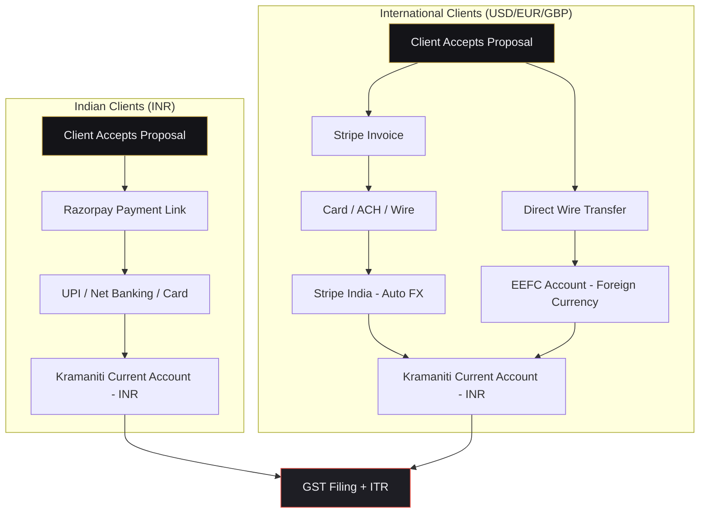

# Launch Operations Checklist

**Purpose:** Provide a sequential, actionable checklist to formally launch Kramaniti as a legal business entity with operational infrastructure — from company registration through payment processing, workspace setup, and CRM configuration. Every step is tailored to Karan's specific situation: solo founder, Bengaluru-based, serving both Indian (INR) and international (USD) clients.

**Key Findings:** India-based solo consultancies have multiple legal structures available. For a single founder with no co-founders or investors at launch, a Sole Proprietorship provides the fastest path to billing clients, while an LLP provides better liability protection and professional credibility for high-ticket B2B engagements.

**Related Files:**
*   [domain_and_handles_registry.md](file:///Users/k.c/kramaniti/03_brand_strategy/naming/domain_and_handles_registry.md) — Domain registration status
*   [service_packages.md](file:///Users/k.c/kramaniti/03_brand_strategy/service_packages.md) — Pricing tiers and billing structures
*   [ai_service_workflows.md](file:///Users/k.c/kramaniti/05_ai_strategy/ai_service_workflows.md) — Delivery workflows requiring tool subscriptions
*   [brand_identity_guidelines.md](file:///Users/k.c/kramaniti/03_brand_strategy/positioning/brand_identity_guidelines.md) — Brand assets for workspace branding
*   [website_structure_and_wireframe.md](file:///Users/k.c/kramaniti/07_business_build/website_structure_and_wireframe.md) — Website deployment dependencies

---

## 1. Business Registration

### 1.1 Choose Legal Structure

`[Recommendation]`: Start with a **Sole Proprietorship** for immediate operations (can invoice within 48 hours), then upgrade to an **LLP** within the first 90 days for liability protection and enterprise credibility.

| Structure | Sole Proprietorship | Limited Liability Partnership (LLP) |
| :--- | :--- | :--- |
| **Best For** | Immediate launch, minimal compliance | High-ticket B2B clients, liability protection |
| **Registration Time** | 1-2 days (GST registration only) | 15-20 business days (MCA filing) |
| **Setup Cost** | ₹0 – ₹2,000 (GST filing fees) | ₹5,000 – ₹15,000 (government fees + CA charges) |
| **Annual Compliance** | GST returns (monthly/quarterly), ITR filing | GST returns, ITR filing, Form 8 + Form 11 (annual LLP returns to MCA) |
| **Liability** | Unlimited personal liability | Limited to capital contribution |
| **Professional Perception** | Acceptable for Indian SMB clients | Preferred by enterprise and international clients |
| **Bank Account** | Current account in personal name + trade name | Dedicated LLP current account |
| **Foreign Payments** | Receivable via personal account (FEMA compliant) | Receivable via LLP account (cleaner compliance) |

### 1.2 Sole Proprietorship Setup Checklist

- [ ] **PAN Card** — Confirm Karan's individual PAN is active and linked to Aadhaar (`[Fact]`: PAN is mandatory for GST registration).
- [ ] **GST Registration** — Apply at `gst.gov.in` as a sole proprietor under trade name "Kramaniti". Required documents: PAN, Aadhaar, bank statement, address proof (rent agreement or electricity bill), passport-size photo. Processing time: 3-7 business days (`[Fact]`).
- [ ] **GSTIN Issuance** — Upon approval, receive the 15-digit GSTIN. This enables issuing GST-compliant tax invoices.
- [ ] **Udyam Registration (MSME)** — Register at `udyamregistration.gov.in` for MSME benefits (priority lending, government tender eligibility). Free of cost. Classification: Micro Enterprise (investment < ₹1 Cr, turnover < ₹5 Cr) (`[Fact]`).
- [ ] **Professional Tax Registration** — Register with the Karnataka Professional Tax authority. Annual liability: ₹2,500 for income above ₹15,000/month (`[Fact]`).
- [ ] **Open Current Account** — Open a business current account at a bank with good UPI and net banking infrastructure. `[Recommendation]`: **RazorpayX** (neobank with built-in invoicing and payment links) or **HDFC Bank Current Account** (strong enterprise reputation for LLP upgrade path).

### 1.3 LLP Upgrade Path (Month 2-3)

- [ ] **Select LLP Partner** — LLP requires a minimum of 2 designated partners (`[Fact]`). If solo, consider designating a trusted family member as a nominal partner with a minimal (e.g., ₹10,000) capital contribution.
- [ ] **DSC (Digital Signature Certificate)** — Obtain Class 2 DSC for both designated partners. Cost: ₹800 – ₹1,500 per DSC. Available from eMudhra, Sify, or Capricorn.
- [ ] **DPIN (Designated Partner Identification Number)** — Apply via MCA portal (`mca.gov.in`). Cost: ₹500 per partner.
- [ ] **Name Reservation** — File Form RUN-LLP on MCA portal to reserve "Kramaniti LLP" or "Kramaniti Consulting LLP". Keep 2-3 name alternatives ready. Processing: 3-5 business days.
- [ ] **LLP Agreement Drafting** — Draft the LLP Agreement specifying capital contributions, profit-sharing ratio, partner obligations, and exit clauses. `[Recommendation]`: Use a CA firm or legal service (Vakilsearch, LegalRaasta) for this — template agreements often miss critical clauses on IP ownership and non-compete.
- [ ] **File Incorporation (Form FiLLiP)** — Submit Form FiLLiP with MCA along with the LLP Agreement, partner consents, and registered office proof. Government fee: ₹500 (< ₹1L capital contribution).
- [ ] **PAN & TAN for LLP** — Apply for a separate PAN and TAN (Tax Deduction Account Number) for the LLP entity. PAN auto-applies via FiLLiP; TAN via TRACES portal.
- [ ] **GST Migration** — Transfer GST registration from sole proprietorship to LLP, or register fresh under the LLP PAN.
- [ ] **Bank Account** — Open a dedicated current account in the LLP's name. Transfer Razorpay/Stripe merchant accounts to the LLP entity.

---

## 2. Workspace Setup

### 2.1 Email & Productivity Suite

`[Recommendation]`: Use **Google Workspace** (Business Starter, $7.20/user/month billed annually) for the custom domain email, Google Drive, Google Meet, and Calendar. Google Workspace is the default in the Indian startup ecosystem and integrates natively with Make.com, Brevo, and the tools in [ai_service_workflows.md](file:///Users/k.c/kramaniti/05_ai_strategy/ai_service_workflows.md).

- [ ] **Register Google Workspace** — Sign up at `workspace.google.com` with the `kramaniti.com` domain (must be registered first — see [domain_and_handles_registry.md](file:///Users/k.c/kramaniti/03_brand_strategy/naming/domain_and_handles_registry.md)).
- [ ] **Configure DNS Records** — Add the MX, SPF, DKIM, and DMARC records to the domain's DNS (Cloudflare dashboard). These are critical for email deliverability and prevent invoices from landing in spam.
    *   `[Recommendation]`: Set a strict DMARC policy (`v=DMARC1; p=reject; rua=mailto:dmarc@kramaniti.com`) after confirming SPF and DKIM are passing. This protects the brand from email spoofing.
- [ ] **Create Core Email Aliases:**
    | Email | Purpose |
    | :--- | :--- |
    | `karan@kramaniti.com` | Primary founder email — client communication, proposals, invoices |
    | `hello@kramaniti.com` | Website contact form destination, general inquiries |
    | `admin@kramaniti.com` | Registrar accounts, SaaS billing, internal tooling |
    | `invoices@kramaniti.com` | Dedicated invoicing sender (Zoho/Stripe receipts route here) |
- [ ] **Set Email Signature** — Design a signature using the brand palette from [brand_identity_guidelines.md](file:///Users/k.c/kramaniti/03_brand_strategy/positioning/brand_identity_guidelines.md). Include: name, title ("Founder & AI Architect"), phone, website URL, LinkedIn profile link. No logo image (images break in many email clients) — use the Outfit-font wordmark as styled text.
- [ ] **Google Drive Structure** — Create the following shared drive structure for client work:
    ```
    Kramaniti Drive/
    ├── 00_Templates/         → Proposal templates, invoice templates, SOW templates
    ├── 01_Clients/           → One subfolder per client (e.g., /Client - WeWork/)
    ├── 02_Internal/          → Internal docs, SOPs, financial records
    ├── 03_Content_Assets/    → Video files, social graphics, blog drafts
    └── 04_AI_Pipelines/      → Make.com scenario exports, prompt libraries
    ```

### 2.2 Password Management

`[Recommendation]`: Use **Bitwarden** (free tier for individual, or $10/year for Premium with TOTP authenticator, encrypted file storage, and emergency access). Bitwarden is open-source, audited, and significantly cheaper than 1Password for a solo operator.

- [ ] **Create Bitwarden Account** — Sign up at `bitwarden.com` with the `admin@kramaniti.com` email.
- [ ] **Install Bitwarden** — Desktop app (macOS), browser extension (Chrome/Arc), mobile app (iOS/Android).
- [ ] **Import Existing Passwords** — Export from current password manager (Keychain, Chrome passwords) and import into Bitwarden.
- [ ] **Enable 2FA on All Critical Accounts** — Use Bitwarden's built-in TOTP authenticator (Premium) or Google Authenticator as backup:
    | Account | 2FA Priority |
    | :--- | :--- |
    | Google Workspace (kramaniti.com) | 🔴 Critical |
    | Cloudflare (domain registrar) | 🔴 Critical |
    | Razorpay / Stripe (payments) | 🔴 Critical |
    | GitHub (if code-hosting agent builds) | 🟠 High |
    | Make.com | 🟠 High |
    | Social accounts (LinkedIn, X, YouTube) | 🟡 Medium |
- [ ] **Generate Unique Passwords** — Use Bitwarden's password generator (20+ characters, mixed case, numbers, symbols) for every SaaS account. Zero password reuse.

### 2.3 Communication & Collaboration

- [ ] **Slack Workspace** — Create a free Slack workspace (`kramaniti.slack.com`) for internal operations and future client channels. Create default channels:
    | Channel | Purpose |
    | :--- | :--- |
    | `#general` | Internal operations, daily log |
    | `#new-leads` | Make.com webhook posts new form submissions here |
    | `#content-pipeline` | Content drafts, editorial calendar updates |
    | `#client-[name]` | Per-client channel (created during onboarding per [ai_service_workflows.md](file:///Users/k.c/kramaniti/05_ai_strategy/ai_service_workflows.md)) |
- [ ] **Calendly** — Set up a Calendly account (`calendly.com/kramaniti`) with a 30-minute "Discovery Call" event type. Connect to Google Calendar. Style using brand colors (background: `#141418`, accent: `#C9A84C`). Set buffer time: 15 minutes before and after. Availability: Mon-Fri, 10:00 AM – 6:00 PM IST.
- [ ] **Loom** — Set up for async client updates and internal SOPs. Free tier (25 videos, 5 min each) is sufficient for launch.

---

## 3. Payment Processing

### 3.1 Domestic Payments (INR)

`[Recommendation]`: Use **Razorpay** as the primary domestic payment gateway. It handles UPI, net banking, cards, and generates GST-compliant payment receipts. Razorpay also offers Payment Links (no-code invoicing) and RazorpayX (current account + payroll).

- [ ] **Create Razorpay Account** — Sign up at `razorpay.com` with `admin@kramaniti.com`. Complete KYC with PAN, GST certificate, bank account details, and business address proof.
- [ ] **Activation Timeline** — Razorpay activation typically takes 2-5 business days after document submission (`[Fact]`).
- [ ] **Configure Payment Links** — Generate shareable payment links for each service tier:
    | Link | Amount | Purpose |
    | :--- | :--- | :--- |
    | `razorpay.me/kramaniti/audit` | ₹75,000 – ₹1,50,000 | Tier 1: AI Audit payment |
    | `razorpay.me/kramaniti/narrative` | ₹1,50,000 – ₹3,00,000 | Tier 2: Narrative Kit payment |
    | `razorpay.me/kramaniti/build` | Custom | Tier 3: Agent Build (custom quote) |
    | `razorpay.me/kramaniti/retainer` | ₹1,20,000 – ₹2,50,000 | Tier 4: Monthly retainer payment |
- [ ] **Enable Razorpay Subscriptions** — For Tier 4 (Content Engine Retainer), set up recurring billing with a 3-month minimum commitment (auto-debit via e-mandate).
- [ ] **GST Configuration** — Enable GST invoicing in Razorpay settings. Set GST rate to 18% (SAC Code: 998314 — "Information technology consulting services") (`[Fact]`).
- [ ] **Settlement Account** — Link to the Kramaniti current account. Standard settlement cycle: T+2 business days (`[Fact]`).

### 3.2 International Payments (USD)

`[Recommendation]`: Use **Stripe** for international clients. Stripe supports USD, EUR, GBP, and 135+ currencies, provides automatic tax receipt generation, and integrates natively with invoicing tools and Make.com webhooks.

- [ ] **Create Stripe Account** — Sign up at `stripe.com` with `admin@kramaniti.com`. Stripe is available for Indian businesses receiving international payments (`[Fact]`: Stripe Atlas is not required; standard Stripe India works).
- [ ] **Complete KYC** — Submit: PAN (individual or LLP), GST certificate, bank account (must accept SWIFT/wire transfers), identity verification.
- [ ] **Stripe India Limitations** — Note that Stripe India settles in INR after converting from the foreign currency. The conversion rate is Stripe's rate + a small markup. For large invoices (>$5,000), compare Stripe's effective rate against a direct wire transfer to the LLP's EEFC (Exchange Earners Foreign Currency) account (`[Recommendation]`).
- [ ] **Configure Stripe Invoicing** — Use Stripe's built-in invoicing for international clients:
    *   Generate PDF invoices with the Kramaniti branding.
    *   Set payment terms: Net 15 (payment due within 15 days).
    *   Enable automatic payment reminders at Day 7 and Day 14.
- [ ] **Stripe Payment Links** — Create shareable payment links denominated in USD for international prospects who prefer card payments over wire transfers.
- [ ] **Tax Compliance for Foreign Income** — `[Recommendation]`: Consult a CA on:
    *   FEMA compliance for receiving foreign remittances.
    *   FIRC (Foreign Inward Remittance Certificate) generation from the bank for each international payment.
    *   Tax treatment of export of services (zero-rated under GST if client is outside India and payment is received in foreign currency) (`[Fact]`).

### 3.3 Payment Flow Summary



---

## 4. Invoicing & CRM

### 4.1 Invoicing Software

`[Recommendation]`: Use **Zoho Invoice** (Free plan — up to 1,000 invoices/year, 5 customers) for the launch phase. Zoho Invoice is India-first, generates GST-compliant invoices, supports multi-currency billing, and integrates with Razorpay and Stripe for automatic payment reconciliation.

- [ ] **Create Zoho Invoice Account** — Sign up at `zoho.com/invoice` with `invoices@kramaniti.com`.
- [ ] **Configure Business Profile:**
    | Field | Value |
    | :--- | :--- |
    | Business Name | Kramaniti (or Kramaniti LLP post-incorporation) |
    | GSTIN | [To be filled post-GST registration] |
    | Business Address | Bengaluru, Karnataka |
    | Default Currency | INR (₹) |
    | Secondary Currency | USD ($) |
    | Payment Terms | Net 15 (domestic), Net 30 (international) |
    | Invoice Prefix | KRM- |
    | Tax Rate | 18% IGST/CGST+SGST |
- [ ] **Invoice Template Customization** — Upload the Kramaniti logo and apply brand colors (background: `#0A0A0F`, accent: `#C9A84C`, text: `#F0F0F5`) to the invoice template. Use Inter font if customizable.
- [ ] **Connect Payment Gateways:**
    *   Link Razorpay to Zoho for INR invoices (auto-reconciliation).
    *   Link Stripe to Zoho for USD invoices (auto-reconciliation).
- [ ] **Set Up Automated Reminders:**
    | Trigger | Action |
    | :--- | :--- |
    | Invoice sent | Auto-send "Invoice received" confirmation email |
    | 7 days before due | Gentle payment reminder |
    | Due date | Firm reminder |
    | 7 days overdue | Escalation email with late payment notice |
- [ ] **Create Invoice Templates for Each Tier:**
    *   Tier 1: AI Audit — Flat fee, single milestone
    *   Tier 2: Narrative Kit — 50% upfront, 50% on delivery
    *   Tier 3: Agent Build — 40% upfront, 30% at midpoint, 30% on handoff
    *   Tier 4: Retainer — Monthly recurring, auto-generated on the 1st

**Alternative Options Evaluated:**

| Tool | Strengths | Weaknesses | Verdict |
| :--- | :--- | :--- | :--- |
| **Zoho Invoice** | Free tier, GST-native, multi-currency, Razorpay/Stripe integration | Free tier limited to 5 customers (sufficient for launch) | ✅ **Selected for launch** |
| **Wave** | Completely free, clean UI, good reporting | No GST support, no INR-native features, limited in India | ❌ Not viable for Indian billing |
| **Stripe Billing** | Seamless for USD clients, auto-tax calculation, great API | Overkill for domestic INR invoicing, no GST compliance features | 🟡 Use alongside Zoho for USD-only clients |
| **Refrens** | India-built, GST-native, free tier, client portal | Less known, limited integrations outside Indian ecosystem | 🟡 Strong backup if Zoho's 5-customer limit becomes restrictive |

### 4.2 CRM & Pipeline Manager

`[Recommendation]`: Use **HubSpot CRM** (Free tier — unlimited contacts, deal tracking, email tracking, meeting scheduler). HubSpot's free CRM is genuinely unlimited for contact storage and provides a clean pipeline view that maps directly to the 4-tier offer ladder.

- [ ] **Create HubSpot Account** — Sign up at `hubspot.com` with `karan@kramaniti.com`.
- [ ] **Configure Deal Pipeline** — Create a custom pipeline matching the sales process:
    | Stage | Description | Probability |
    | :--- | :--- | :--- |
    | **Lead Captured** | Form submitted on website or email received | 10% |
    | **Discovery Call Booked** | Calendly event confirmed | 25% |
    | **Discovery Call Completed** | Call held, needs identified | 40% |
    | **Proposal Sent** | SOW/proposal document shared | 60% |
    | **Negotiation** | Pricing or scope discussion in progress | 75% |
    | **Closed Won** | Contract signed, payment received | 100% |
    | **Closed Lost** | Prospect declined or went silent | 0% |
- [ ] **Connect to Make.com** — Set up a Make.com scenario that auto-creates a HubSpot Contact + Deal when a website form is submitted. Map the "Budget Range" form field to the Deal Amount field.
- [ ] **Email Integration** — Connect the `karan@kramaniti.com` Google Workspace account to HubSpot for automatic email logging and tracking (opens, clicks, replies).
- [ ] **Contact Properties** — Add custom properties:
    | Property | Type | Purpose |
    | :--- | :--- | :--- |
    | `service_tier_interest` | Dropdown (Tier 1-4) | Track which service the lead is interested in |
    | `client_vertical` | Dropdown (CRE, SaaS, Agency, Other) | Align with target verticals from [positioning_analysis.md](file:///Users/k.c/kramaniti/03_brand_strategy/positioning/positioning_analysis.md) |
    | `referral_source` | Text | Track how the lead found Kramaniti |
    | `currency` | Dropdown (INR, USD) | Route to correct invoicing flow |
- [ ] **Meeting Link** — Connect Calendly to HubSpot (or use HubSpot's native meeting scheduler) so booked calls auto-create timeline events on the contact record.

---

## 5. Launch Execution Timeline

`[Recommendation]`: Execute the following in sequence. Total estimated time to operational readiness: 3-4 weeks.

| Week | Phase | Key Actions |
| :--- | :--- | :--- |
| **Week 1** | Digital Assets | Register domains (kramaniti.com, kramaniti.ai). Secure social handles (@kramaniti everywhere). Set up Google Workspace + DNS. Set up Bitwarden. |
| **Week 2** | Legal & Financial | Apply for GST registration (sole proprietorship). Open current account. Set up Razorpay. Set up Stripe. Begin LLP documentation with CA. |
| **Week 3** | Tooling & Automation | Set up Zoho Invoice + templates. Set up HubSpot CRM + pipeline. Configure Make.com webhook for form → Sheets → Slack → HubSpot → Brevo flow. Set up Calendly. Set up Slack workspace. |
| **Week 4** | Launch | Deploy website to Cloudflare Pages. Connect domain. Publish LinkedIn Company Page. Post launch announcement on LinkedIn, X, and YouTube Community. Send first email to warm contacts. |

---

## 6. Monthly Operational Costs (Estimated)

| Tool / Service | Plan | Monthly Cost | Annual Cost |
| :--- | :--- | :--- | :--- |
| Google Workspace | Business Starter | $7.20/mo (₹600) | $86.40/yr (₹7,200) |
| Cloudflare (kramaniti.com + .ai) | Free plan + domains | ₹0 (plan) + ~₹7,000/yr (domains) | ~₹7,000/yr |
| Bitwarden | Premium | ₹85/mo ($10/yr) | ₹850/yr |
| Razorpay | Pay-as-you-go (2% per txn) | Variable | Variable |
| Stripe | Pay-as-you-go (2% + 30¢ per intl txn) | Variable | Variable |
| Zoho Invoice | Free | ₹0 | ₹0 |
| HubSpot CRM | Free | ₹0 | ₹0 |
| Calendly | Free | ₹0 | ₹0 |
| Slack | Free | ₹0 | ₹0 |
| Make.com | Free (1,000 ops/mo) → Core ($10.59/mo) | ₹0 – ₹900/mo | ₹0 – ₹10,800/yr |
| Brevo (Sendinblue) | Free (300 emails/day) | ₹0 | ₹0 |
| **Total Fixed Overhead** | | **~₹1,500 – ₹2,500/mo** | **~₹18,000 – ₹30,000/yr** |

`[Recommendation]`: Total fixed operational overhead is under ₹2,500/month — well under 3% of even a single Tier 1 engagement. This keeps the cost structure lean and preserves margin for reinvestment into tools, content, and the LLP upgrade.

---

## 7. Open Questions

1.  `[Recommendation]`: Should Kramaniti register as a sole proprietorship immediately for speed, or wait for the LLP to be incorporated first? The checklist above recommends starting as sole proprietorship and upgrading, but if the LLP can be fast-tracked (15-20 days with a responsive CA), it may be worth delaying client invoicing to launch under the LLP directly.
2.  `[Unverified]`: Does Karan already have an active GST registration from previous freelance work (HowDramaTech era)? If so, it may need to be amended rather than re-applied.
3.  `[Recommendation]`: For international payments above $5,000, should Kramaniti open an EEFC (Exchange Earners Foreign Currency) account to hold USD and time conversions favorably, or rely on Stripe's auto-conversion?
4.  `[Unverified]`: What is the current bank relationship? If Karan already holds an HDFC or ICICI account, opening the current account at the same bank may expedite KYC.

---

## 8. Next Steps

1.  Schedule a 30-minute call with a CA (Chartered Accountant) to finalize the legal structure decision and begin GST registration.
2.  Execute Week 1 actions from the timeline: domain registration + social handles + Google Workspace.
3.  Log all registration confirmations and account credentials in Bitwarden.
4.  Update this checklist by marking items as completed and logging decisions in [decisions.md](file:///Users/k.c/kramaniti/09_reviews/decisions.md).
